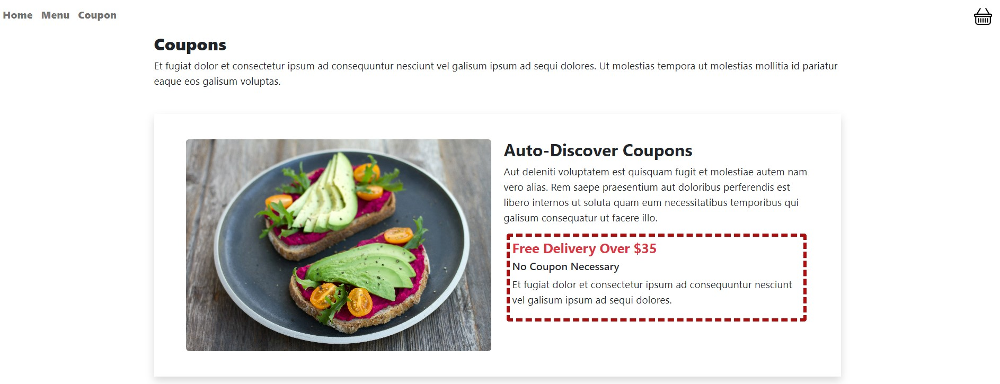
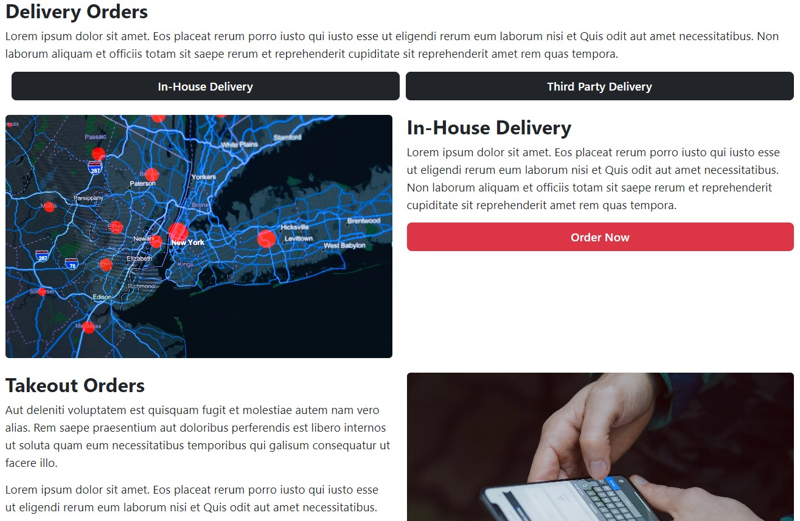

# MyFoodie-Restaurant

## Reason for creation:

MyFoodie Restaurant is my preparation for an interview project. In this project, I tried to build one of the restaurant websites and test my web development skills. I tried to match the layout and styling from the company's website.

 

### Project uses:

- Bootstrap
- CSS (flex box for the layout)
- jQuery
